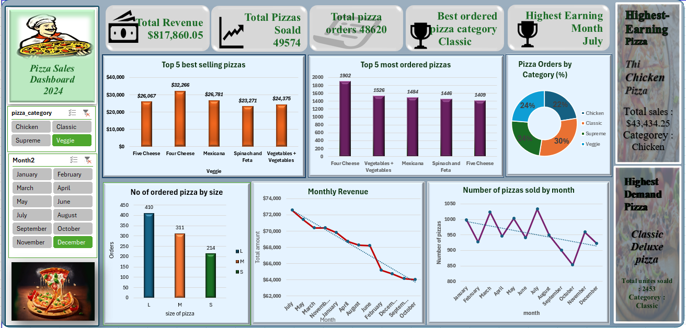
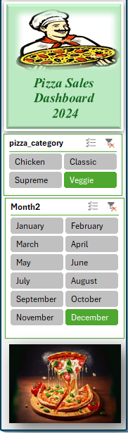
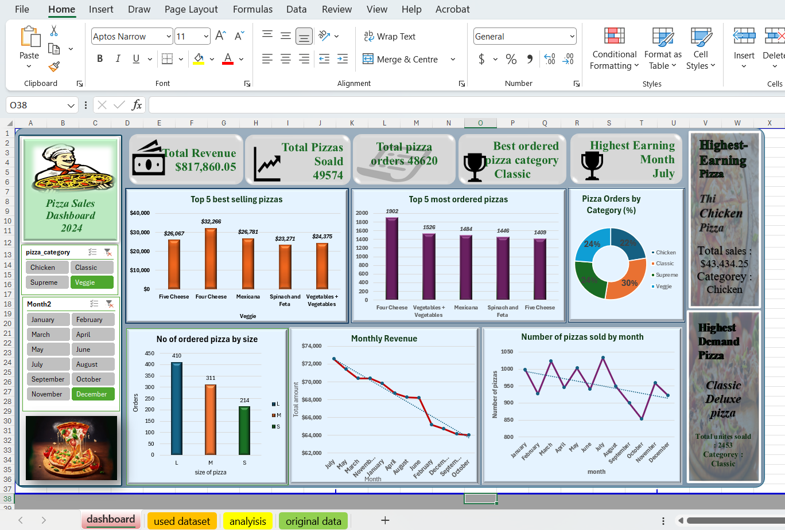
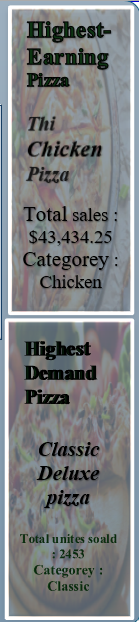
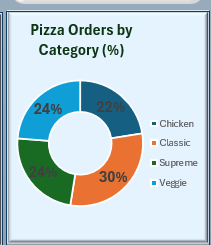
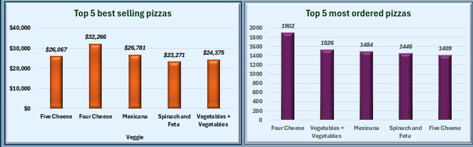
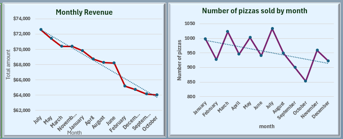

# Pizza Sales Dashboard (2024)

An interactive Excel analytics dashboard designed to monitor, track, and optimize the operational and financial performance of a pizza franchise. This repository contains the source data and dashboard interface used to transform transactional records into actionable business insights.

## 🎓 Academic Context

This project was completed as part of academic learning to apply concepts in:

- Data Analysis
- Business Intelligence
- Data Visualization
- Spreadsheet Analytics
- Dashboard Development

The objective was to transform raw transactional data into meaningful business insights using Excel

---

## 📌 Core Architecture: What This Dashboard Shows

This dashboard provides a comprehensive view of the franchise's business health over the year 2024. It bridges the gap between high-level executive summaries and granular operational realities by presenting data across three structural levels:

1. **Executive Key Performance Indicators (KPIs):** Immediately highlights overall business health at a glance, showing cumulative gross revenue (`$817,860.05`), total volume sold (`49,574` pizzas), absolute volume of processed baskets (`48,620` orders), the most popular product group (`Classic`), and the peak business season (`July`).
2. **Product & Portfolio Performance:** Identifies revenue-driving items versus high-frequency volume drivers. It outlines product mix distributions, consumer size preferences, and flags the absolute top-performing individual menu items across the entire catalog.
3. **Temporal Trend Analysis:** Tracks macro business momentum, revealing revenue stability patterns, volume fluctuations, and baseline trajectory vectors across different months of the year.

---

## 🎛️ Dynamic Interactivity: Using the Slicers

The dashboard features native, real-time interactive menus (Slicers) on the left side that completely alter the visual ecosystem when manipulated:

* **`pizza_category` Slicer (Chicken, Classic, Supreme, Veggie):**
  * **What happens:** Selecting any category instantly filters every single visualization across the page. It isolates metrics to show exactly how that specific product class behaves. For example, selecting `Veggie` updates the entire screen to reveal *only* veggie pizza sales metrics, their individual top earners, size distributions, and specific category trends.
* **`Month2` Slicer (January - December):**
  * **What happens:** Allows stakeholders to cross-filter performance by specific discrete time windows. Selecting a month isolates the metrics to that exact period, enabling swift monthly business reviews, post-promotional analysis, or seasonal deep-dives.
* **Multi-Select Compatibility:** Users can hold control/command keys to select multiple months or categories simultaneously (e.g., combining `November` and `December` for a complete performance review).

---

## 📊 Comprehensive Visual Insights (Overall Chart Capabilities)

Rather than forcing static calculations, the dashboard visualizes operational patterns through an array of interconnected charts designed for overall system evaluation:

### 🌟 Main System Overview
The dashboard features an integrated workspace that synchronizes data across metrics, product distributions, and linear sales trends in real time.

---

### 📦 Structural Metric Cards & Champion Spotlights
* **Top Ribbon KPIs:** Dynamically calculates consolidated metrics, validating processing velocity, gross revenue generation, and global operational peaks.
  
  
* **Menu Highlights Panel:** Isolate and flag the top standout products in the entire database- showing exactly which item captures the highest cash flow (*Thai Chicken Pizza*) and which item captures the highest consumer demand volume (*Classic Deluxe Pizza*).
  

---

### 🍕 Portfolio Mix & Consumer Form-Factor Preference
* **Pizza Orders by Category (% Share):** A portfolio distribution donut chart that breaks down macro customer preference trends across major menu groups, showing portfolio balance and stability.
* **Number of Ordered Pizzas by Size:** A volume bar chart structured around consumer size choices (**L, M, S**). This gives inventory and supply-chain managers a clear look at production sizing demand to optimize box and dough preparations.

&nbsp;&nbsp;&nbsp;&nbsp;&nbsp;&nbsp;&nbsp;&nbsp;

---

### 🏆 Product Performance Benchmarking
* **Top 5 Best Selling & Most Ordered Pizzas:** Dual side-by-side vertical bar charts that contrast financial impact against pure volume frequency. It clarifies whether items are driving value through high premium margins or through rapid order turnaround.

---

### 📈 Volume Fluctuation & Seasonal Revenue Trends
* **Monthly Revenue & Volume Trend Lines:** Dual visualization lines embedded with auto-calculated statistical trend vectors. These lines map chronological sales momentum, highlighting sharp holiday or summer spikes versus operational troughs to improve annual budget planning and marketing distribution schedules.

---

## 💡 Strategic Takeaways Addressed
* **Optimized Inventory Sizing:** Guides suppliers to structure storage volumes around Large scale allocations rather than Small alternatives based on raw ordering popularity.
* **Balanced Menu Architecture:** Highlights low-risk business resilience due to balanced, near-equal segment distributions across major dietary categories.
* **Value vs. Velocity Discovery:** Separates premium margin anchors from rapid-turnover volume drivers, maximizing product placement and promotional design strategies.

---
## 👤 Author

**Dinusha Priyashan**

Data Science Undergraduate  
University of Colombo

---

## 📄 License
This repository is shared for **educational and portfolio purposes only**.
